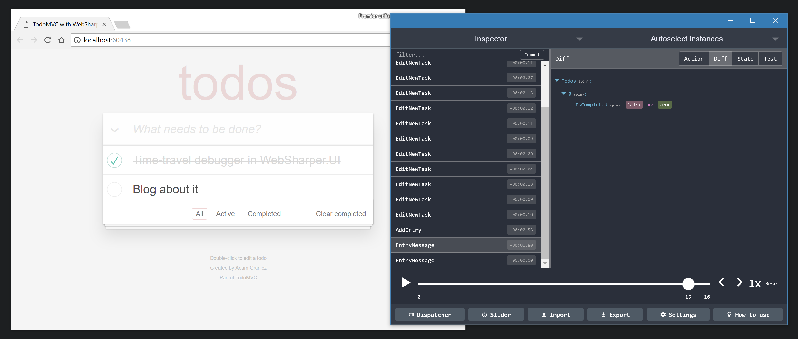
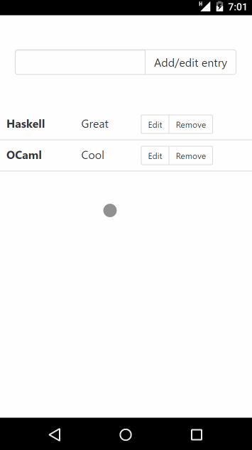

This library implements an [Elm](https://guide.elm-lang.org/architecture/)-inspired MVU (Model-View-Update) architecture for WebSharper client-side applications.

It is based on [WebSharper.UI](http://developers.websharper.com/docs/v4.x/fs/ui) for its reactivity and HTML rendering.

# The MVU architecture

Model-View-Update is an application architecture that aims to make the behavior and state of GUIs clear and predictable.

The state of the application is stored as a single **Model**, which is an immutable value (generally a record).

This is rendered by a **View** [1], which defines how the model is transformed into DOM elements.

Finally, all changes to the model are applied by a pure **Update** function, which takes messages sent by the view and applies changes accordingly.

[1] Although in WebSharper.Mvu we tend to use the term **Render** instead, to avoid confusion with the WebSharper.UI `View` type.

# Features of WebSharper.Mvu

WebSharper.Mvu provides a number of features on top of this architecture.

## Time-travel debugging with RemoteDev

WebSharper.Mvu integrates seamlessly with [RemoteDev](https://github.com/zalmoxisus/remotedev). This tool allows you to inspect the successive messages and states of your model, and even to replay old states and see the effect on your view.



This is done by adding a single line to your app declaration:

```fsharp
App.Create initialModel update render
|> App.WithRemoteDev (RemoteDev.Options(hostname = "localhost", port = 8000))
|> App.Run
```

[Learn more about WebSharper.Mvu and RemoteDev.](docs/remotedev.md)

## Automatic local storage

WebSharper.Mvu can automatically save the model to the local storage on every change. This allows you to keep the same application state across page refreshes, which is very useful for debugging.

This is done by adding a single line to your app declaration:

```fsharp
App.Create initialModel update render
|> App.WithLocalStorage "key"
|> App.Run
```

## HTML templating

WebSharper.Mvu can make use of WebSharper.UI's HTML templating facilities. This reinforces the separation of concerns by keeping the view contained in HTML files. The render function then just connects reactive content and event handlers to the strongly-typed template holes.

Templating also allows you to touch up your view without having to recompile the application.

[Learn more about WebSharper.UI HTML templating.](http://developers.websharper.com/docs/v4.x/fs/ui#templating)

## Paging

The `Page` type makes it easy to write "multi-page SPAs": applications that are entirely client-side but still logically divided into different pages. It handles parameterized pages and allows using CSS transitions between pages. Pages can specify their DOM behavior, such as keeping elements around to allow for smoother transitions.

Here is a small application that demonstrates this. [You can run it live on TrywebSharper.](http://try.websharper.com/snippet/loic.denuziere/0000Kc)



This is the structure of [the view for the above application](https://github.com/dotnet-websharper/mvu/blob/master/WebSharper.Mvu.Tests/Client.fs):

```fsharp
type EndPoint = Home | EditEntry of string

type Model = { EndPoint : EndPoint; (* ... *) }

module Pages =

    let Home = Page.Single(attrs = [Attr.Class "home-page"], render = fun dispatch model ->
        // ...
    )

    let EditEntry = Page.Create(attrs = [Attr.Class "entry-page"], render = fun key dispatch model ->
        // ...
    )

let render model =
    match model.EndPoint with
    | EndPoint.Home -> Pages.Home ()
    | EndPoint.EditEntry key -> Pages.EditEntry key

let main () =
    App.CreatePaged initialModel update render
    |> App.Run
```

The transitions are specified as [CSS transitions on the `home-page` and `entry-page` classes](https://github.com/dotnet-websharper/mvu/blob/master/WebSharper.Mvu.Tests/wwwroot/index.html).

## Routing

The page's URL can be easily bound to the application model. The URL scheme is declared using a [WebSharper router](http://developers.websharper.com/docs/v4.x/fs/sitelets#sitelet-infer), and the parsed endpoint value is stored as a field in the model.

Routing and paging work nicely together, but neither requires the other.

Routing is implemented by adding a single line to your app declaration:

```fsharp
type EndPoint = // ...

type Model = { EndPoint : EndPoint; (* ... *) }

let app = App.Create initialModel update render
App.WithRouting (Router.Infer<EndPoint>()) (fun model -> model.EndPoint) app
|> App.Run
```

# Differences with other MVU libraries

The main point that differenciates WebSharper.Mvu from other MVU libraries is the way the render function works.

In most MVU libraries, the view function directly takes a Model value as argument. It is called every time the model changes, and returns a new representation of the rendered document every time. This new representation is then applied to the DOM by a diffing DOM library such as React.

In contrast, in WebSharper.Mvu, the render function takes a WebSharper.UI `View<Model>` as argument. It is called only once, and it is this `View` that changes every time the model is updated. This helps make more explicit which parts of the rendered document are static and which parts are reactive.

# Learn more...

About WebSharper.Mvu:

* [Try Paging live](http://try.websharper.com/snippet/loic.denuziere/0000Kc)

About WebSharper:

* [WebSharper](https://websharper.com)
* [WebSharper UI](http://developers.websharper.com/docs/v4.x/fs/ui)
* [WebSharper Forums](https://forums.websharper.com)
